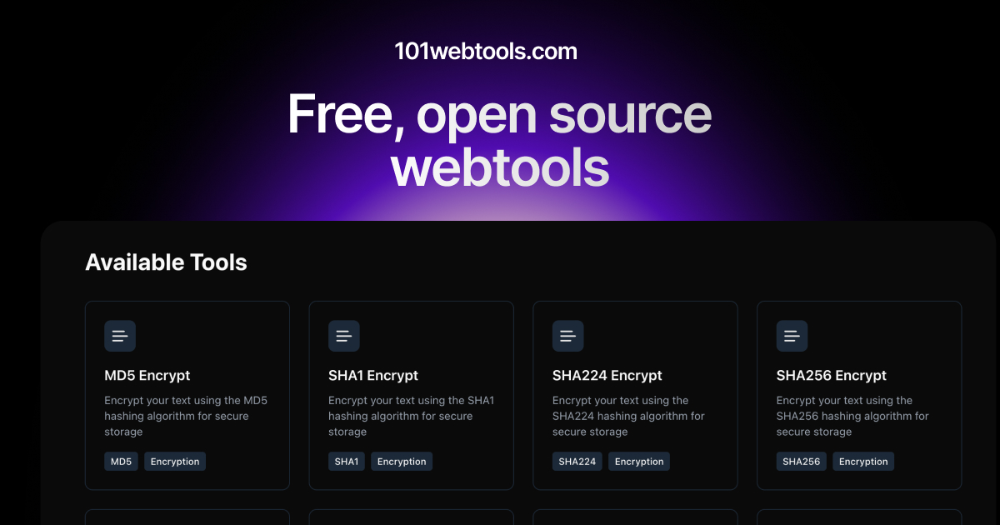

<a id="readme-top"></a>

<!-- PROJECT LOGO -->
<br />
<div align="center">
  <a href="https://101webtools.com">
    
  </a>

  <h3 align="center">101webtools.com</h3>

  <p align="center">
    A collection of free, open-source online tools to help you with your web development projects.
    <br />
    <a href="https://101webtools.com"><strong>Visit the Website »</strong></a>
    <br />
    <br />
    <a href="https://101webtools.com/#tools-section">Explore Tools</a>
    &middot;
    <a href="https://github.com/mnove/101webtools/issues/new?labels=bug&template=bug-report---.md">Report Bug</a>
    &middot;
    <a href="https://tally.so/r/3jzroJ">Request New Tool</a>
  </p>
</div>

<!-- TABLE OF CONTENTS -->
<details>
  <summary>Table of Contents</summary>
  <ol>
    <li>
      <a href="#about-the-project">About The Project</a>
      <ul>
        <li><a href="#built-with">Built With</a></li>
      </ul>
    </li>
    <li>
      <a href="#getting-started">Getting Started</a>
      <ul>
        <li><a href="#prerequisites">Prerequisites</a></li>
        <li><a href="#installation">Installation</a></li>
      </ul>
    </li>
    <li><a href="#available-tools">Available Tools</a></li>
    <li><a href="#contributing">Contributing</a></li>
    <li><a href="#license">License</a></li>
    <li><a href="#contact">Contact</a></li>
  </ol>
</details>

<!-- ABOUT THE PROJECT -->

## About The Project

  <a href="public/cover.jpg">
    
  </a>

101webtools.com is a comprehensive collection of free online tools designed to enhance web development workflows. Whether you need to generate UUIDs, minify JavaScript code, encode/decode Base64, or create QR codes, this platform provides a wide range of utilities accessible directly from your browser.

All the tools are open source.

The project features:

- **Free Tools**: A growing collection of utilities for developers and designers
- **Modern UI**: Clean, responsive interface built with Next.js and Tailwind CSS
- **Progressive Web App**: Install as a PWA for offline access to selected tools
- **Open Source**: Community-driven development

<p align="right">(<a href="#readme-top">back to top</a>)</p>

### Built With

- [![Next.js][Next.js]][Next-url]
- [![React][React.js]][React-url]
- [![Tailwind CSS][Tailwind]][Tailwind-url]
- [![TypeScript][TypeScript]][TypeScript-url]
- [![shadcn/ui][shadcn/ui]][shadcn/ui-url]

<p align="right">(<a href="#readme-top">back to top</a>)</p>

<!-- GETTING STARTED -->

## Getting Started

To get a local copy up and running, follow these simple steps.

### Prerequisites

- Node.js (v18 or higher)
- pnpm
  ```sh
  npm install -g pnpm
  ```

### Installation

1. Clone the repository
   ```sh
   git clone https://github.com/yourusername/101webtools.git
   ```
2. Install dependencies
   ```sh
   cd 101webtools
   pnpm install
   ```
3. Run the development server
   ```sh
   pnpm dev
   ```
4. Open [http://localhost:3000](http://localhost:3000) in your browser

<p align="right">(<a href="#readme-top">back to top</a>)</p>

<!-- AVAILABLE TOOLS -->

## Available Tools

101webtools.com offers a variety of tools categorized for different purposes:

- **Encryption Tools**

  - MD5 Encrypt
  - SHA1 Encrypt
  - SHA224 Encrypt
  - SHA256 Encrypt
  - SHA384 Encrypt
  - SHA512 Encrypt

- **Security Tools**

  - Password Generator

- **Text Manipulation**

  - Binary to Text Converter
  - Base64 Encoder/Decoder
  - URL Encoder/Decoder

- **Code Minifiers**

  - JavaScript Minifier
  - CSS Minifier
  - HTML Minifier

- **Code Generators**

  - Barcode Generator
  - QR Code Generator

- **ID Generators**

  - Nano ID Generator
  - UUID Generator
  - ULID Generator

- **Design Tools**

  - Typographic Scale Generator

- **Productivity Tools**
  - Pomodoro Timer

<p align="right">(<a href="#readme-top">back to top</a>)</p>

<!-- CONTRIBUTING -->

## Contributing

For contributions, please refer to the [CONTRIBUTING.md](CONTRIBUTING.md) file.

<!-- LICENSE -->

## License

Distributed under the MIT License. See `LICENSE` file for more information.

<p align="right">(<a href="#readme-top">back to top</a>)</p>

<!-- CONTACT -->

## Contact

Marcello - [@mnove](https://github.com/mnove) -

<!-- [Portfolio]() -->

Project Link: [https://101webtools.com](https://101webtools.com)

<p align="right">(<a href="#readme-top">back to top</a>)</p>

<!-- MARKDOWN LINKS & IMAGES -->

[Next.js]: https://img.shields.io/badge/next.js-000000?style=for-the-badge&logo=nextdotjs&logoColor=white
[Next-url]: https://nextjs.org/
[React.js]: https://img.shields.io/badge/React-20232A?style=for-the-badge&logo=react&logoColor=61DAFB
[React-url]: https://reactjs.org/
[Tailwind]: https://img.shields.io/badge/tailwind-06B6D4?style=for-the-badge&logo=tailwindcss&logoColor=white
[Tailwind-url]: https://tailwindcss.com/
[TypeScript]: https://img.shields.io/badge/TypeScript-007ACC?style=for-the-badge&logo=typescript&logoColor=white
[TypeScript-url]: https://www.typescriptlang.org/
[shadcn/ui]: https://img.shields.io/badge/shadcnui-000000?style=for-the-badge&logo=shadcnui&logoColor=white
[shadcn/ui-url]: https://ui.shadcn.com
